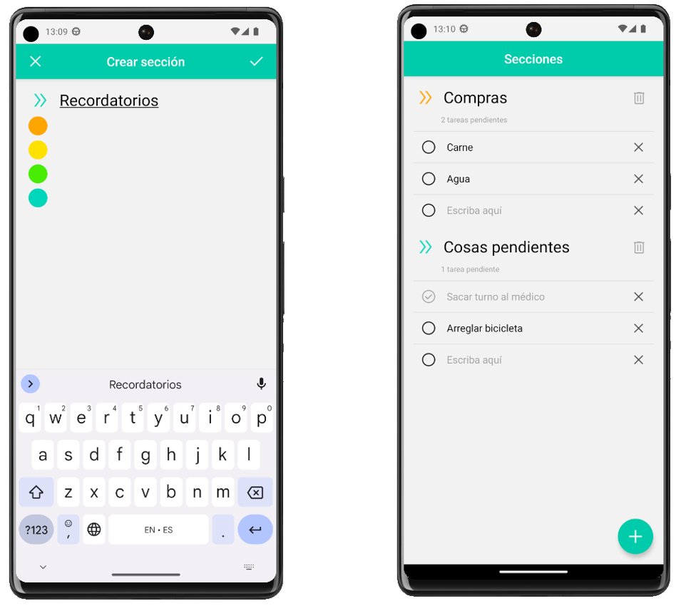

## ToDoList App
To do app desarrollada con *React Native* para la materia *"Diseño de aplicaciones móviles"* de la Universidad Tecnológica Nacional.
Se puede **crear secciones** y **agregar**, **eliminar** y **marcar como completado** items dentro de ellas.



---

### Ejecutar el proyecto

Ejecutar el siguiente comando para iniciar *Metro*:
```bash
npx react-native start
```

Luego, para ejecutarla en Android:
```bash
npx react-native run-android
```